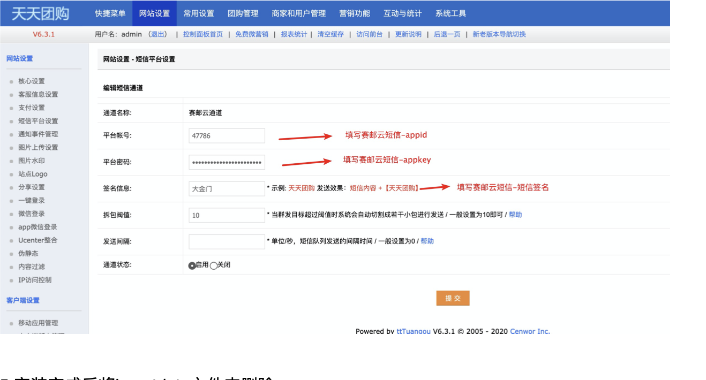
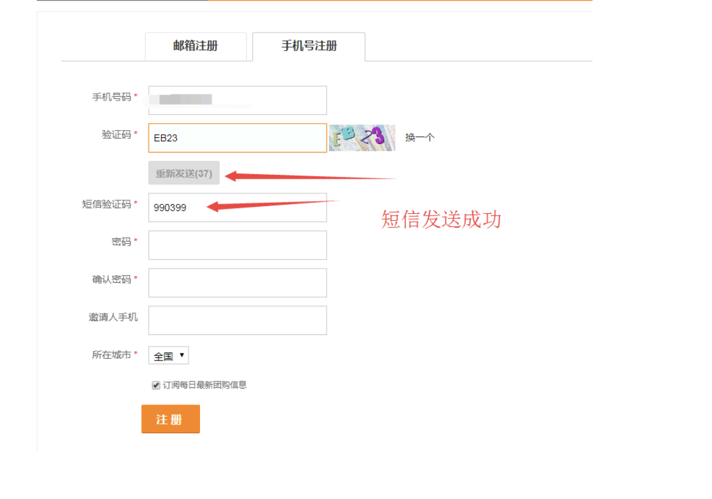

## OVERVIEW

### TTtuangou Plug-Ins Overview

>天天社区团购系统是一套基于微信小程序开发的社区团购商城系统。

------

天天团购  [官网地址](http://www.tttuangou.net/)

How to use

-	include/driver/service/sms.submail.php
-	insertdata/insert.php
-	modules/apiz.mod.php
-	setting/service.php
-	templates/admin/service_sms_list.html
-	templates/admin/service_sms_mgr.html

使用方法

		1:首先将天天团购正确安装
		2:将本目录下三个文件夹上传至网站根目录，覆盖原有文件
		3:运行insert.php文件:http://你的网址/insertdata/insert.php，出现job done说明数据插 入成功
		4:进入后台，刷新缓存，选择网站设置->短信平台设置，选择赛邮云，设置里面填写赛邮云Appid，赛邮云Signature以及短信签名等即可。
		5:安装完成后将insertdata文件夹删除 6:测试手机注册 短信发送

[Github项目地址](https://github.com/submail-developers/tttuangou_sms/)&nbsp;&nbsp;&nbsp;[点击下载](https://github.com/submail-developers/tttuangou_sms/archive/master.zip)
